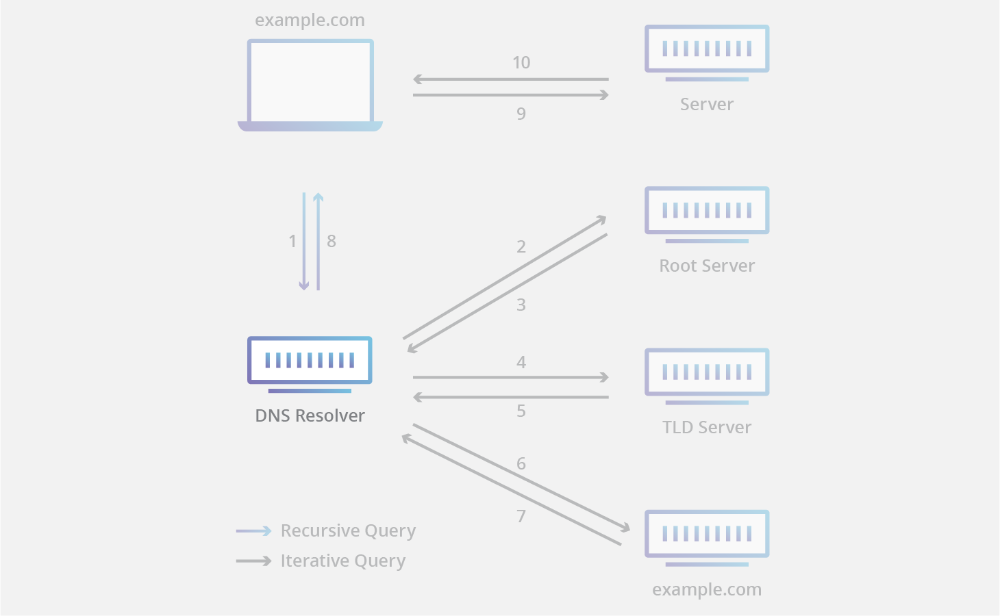
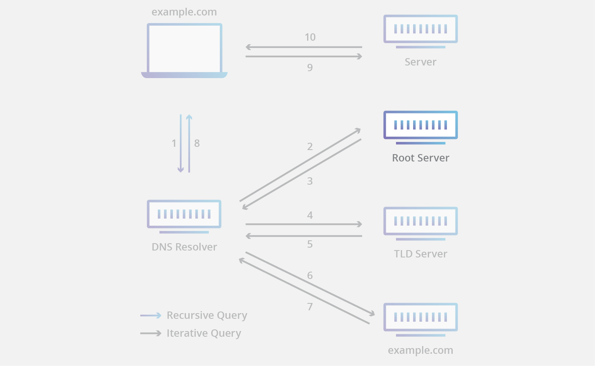
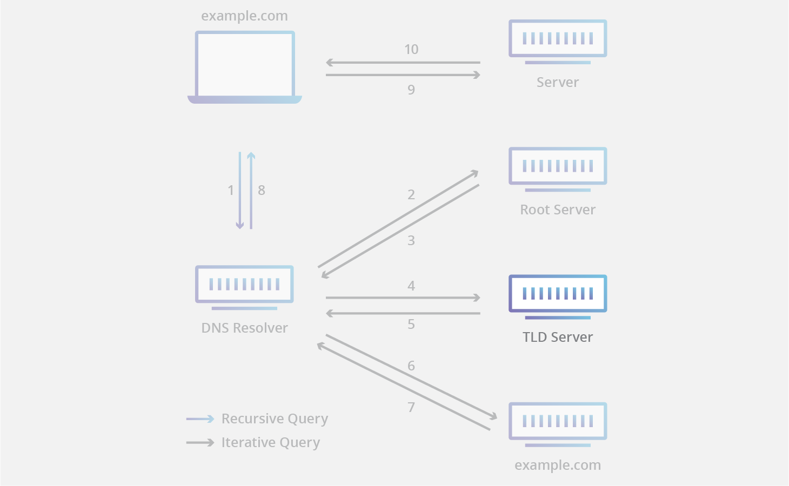

## DNS服务器有哪些不同的类型?

所有DNS服务器都分属于以下四种类型之一: 递归解析器（Recursive resolvers）、根域名服务器（Root nameservers）、顶级域名服务器（TLD nameservers）和权威域名服务器（Authoritative nameservers）。典型的DNS查询（当没有缓存参与时）中，这四个DNS服务器一起工作协调完成任务，这些任务将指定域的IP地址交付给客户端（这客户端一般是根解析器，一个系统内置的简单解析器）

## 什么是DNS递归解析器

递归解析器（也称为DNS递归器 DNS recursor）是DNS查询的第一站。递归解析器扮演客户端与DNS域名服务器之间的中间人。接收到Web客户端的DNS查询后，递归解析器或者回复曾经缓冲的数据，或者发送请求到根域名服务器。接收到权威域名服务器包含请求的IP地址的响应后，递归解析器将发送响应给客户端。

在这过程中，递归解析器将缓存从权威域名服务器接收到的信息。当客户端请求IP地址，而这地址最近被其它客户端请求过，解析器可以绕过与域名服务器通信的过程，只从缓存中向客户机交付所请求的记录。

大多数互联网用户使用由ISP提供的递归解析器，但也有其他可用的选项；例如Cloudflare的1.1.1.1。

## 什么是根域名服务器

每个递归解析器都知道13个DNS根域名解析器，它们是递归解析器查找DNS记录的第一站。根域名服务器接受包含域名的递归解析器的查询，而且根域名服务器以基于指定域的扩展(.com、.net、.org等)，指引递归服解析器到顶级域名服务器作为响应。根域名服务器由非盈利机构监管，该机构名称为互联网域名与地址管理机构（Internet Corporation for Assigned Name and Numbers, ICANN）。

注意，虽然有13个根域名服务器，但这并不意味着根域名服务器系统中只有13台机器。有13种类型的域名服务器，但是在世界各地都有每个域名服务器的多个副本，它们使用Anycast routing来提供快速响应。如果你累计所有根域名服务器的实例，你会找到632个不同的服务器（截止至2016年10月）

## 什么是顶级域名服务器

顶级域名服务器为所有共享公共域扩展名的域名维护信息，例如： .com、.net或url中最后一个点之后的任何域名。例如，一个.com顶级域名服务器包含以.com结尾的每个网站的信息。如果用户正在搜索“google.com”，在收到来自根域名服务器的响应之后，递归解析器将向.com顶级域名服务器发送查询，该域名服务器将通过指向该域名的权威域名服务器(见下文)进行响应。

顶级域名服务器的管理由Internet Assigned Numbers Authority (IANA)负责，IANA是ICANN的一个分支。IANA将顶级域名服务器分成两组:

* 通用顶级域名(generic top-level domains)：这些域名不是特定于国家的，一些最著名的通用顶级域名包括 .com、.org、.net、.edu和.gov。

* 国家代码顶级域名(country code top-level domains)：包括特定于某个国家或州的任何域名。例如： .uk、.us、.ru和.jp

实际上，基础设施领域还有第三类，但几乎从未使用过。这个类别是为.arpa域创建的，它是用于创建现代DNS的过渡域；它今天的意义主要是历史性的。

## 什么是权威域名服务器

当递归解析器接收到来自顶级域名服务器的响应时，该响应将把解析器指向权威域名服务器。权威域名服务器通常是IP地址解析器旅程中的最后一步。权威命名服务器包含特定于所服务的域名信息(例如google.com)，它可以提供一个递归解析器的IP地址，服务器的DNS记录，或如果域名有一个CNAME记录(别名)，它将为递归解析器提供一个别名域，此时递归解析器必须执行一个完整的全新的DNS查询从一个权威域名服务器(通常是一个包含一个IP地址的记录)中获取记录。Cloudflare DNS分发权威域名服务器，这些权威域名服务器连带Anycast routing一起提供，以使它们更加可靠。