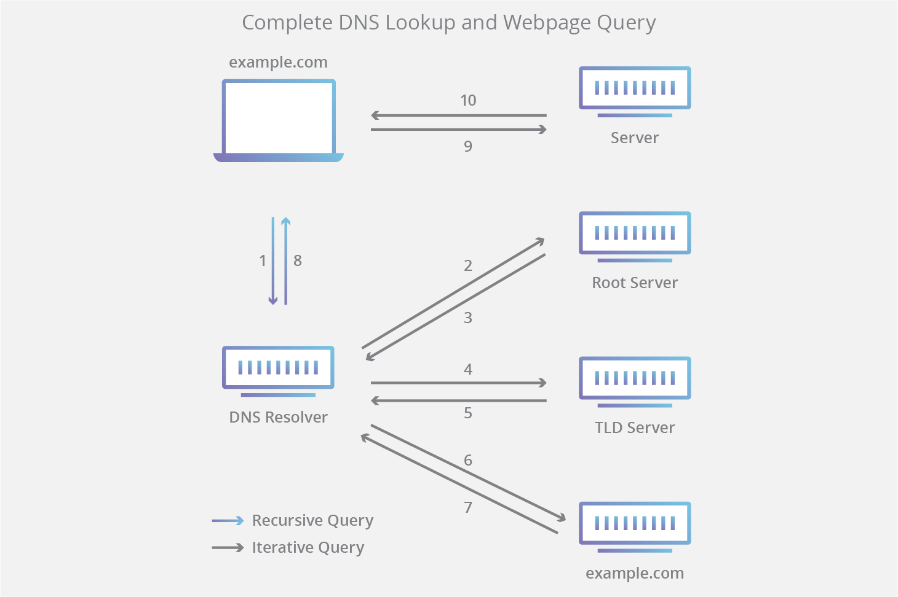

## 什么是DNS

域名系统(DNS)是互联网的电话簿。人们通过域名在线获取信息，比如nytimes.com或espn.com。Web浏览器通过互联网协议(IP)地址进行交互。DNS将域名转换为IP地址，这样浏览器就可以加载互联网资源。

每个连接到Internet的设备都有一个唯一的IP地址，其他机器使用这个IP地址来查找设备。DNS服务器消除了人类记忆IP地址的需要，比如192.168.1.1(在IPv4中)，或者更复杂的更新的字母数字IP地址，比如2400:cb00:2048:1::c629:d7a2(在IPv6中)。

## DNS是如何工作的？

DNS的解析过程涉及到将域名（例如：www.example.com）转换成对机器友好的IP地址（例如：192.168.1.1）。互联网上的每个设备都有一个IP地址，要找到合适的互联网设备，这个地址是必需的 ———— 就像就像街道地址是用来寻找一个特定的住宅。当用户想要加载一个网页时，用户在其web浏览器中输入的内容(example.com)和定位example.com网页所需的机器友好地址之间的转换就会发生。

为了理解DNS解析背后的过程，了解不同硬件组件非常重要，DNS查询必须在这些组件间传递。

加载网页所涉及的4个DNS服务器:

* DNS递归器 (DNS recursor)：
递归器可以被看作是一个图书管理员，他被要求去图书馆的某个地方找一本特定的书。DNS递归器是一种服务器，用于通过web浏览器等应用程序接收来自客户机的查询。然后，通常递归器负责发出额外的请求，以满足客户机的DNS查询。

* 根域名服务器 (Root nameserver)：
根域名服务器是将人类可读的域名转换(解析)为IP地址的第一步。它可以被看作是图书馆中指向不同书架的目录————通常它作为指向其他更具体位置的参考。

* 顶级域名服务器 (TLD nameserver)：
顶级域服务器(TLD)可以看作是图书馆中特定的书架。这个名称服务器是搜索特定IP地址的下一步，它承载主机名的最后一部分(在example.com中，TLD服务器是“com”)。

* 权威域名服务器 (Authoritative nameserver)：
这个最终的域名服务器可以被认为是一本书籍的字典，在其中一个特定的名字可以被翻译成它的定义。域名服务器是域名查询的最后一站。如果权威名称服务器能够访问所请求的记录，它将返回被请求的域名的IP地址，返回给初始请求的DNS递归器(图书管理员)。

## DNS查询的8个步骤:

1. 用户在网络浏览器中输入“example.com”，查询就会进入互联网，并由DNS递归解析器接收。

2. 然后解析器查询DNS根名称服务器(.)。

3. 然后，根服务器使用顶级域(TLD) DNS服务器(如.com或.net)的地址响应解析器，该服务器存储其域的信息。在搜索example.com时，我们的请求指向。com TLD。

4. 然后解析器向。com TLD发出请求。

5. 然后，TLD服务器使用域名服务器example.com的IP地址进行响应。

6. 最后，递归解析器向域的名称服务器发送一个查询。

7. 然后将example.com的IP地址从名称服务器返回给解析器。

8. 然后DNS解析器使用最初请求的域的IP地址响应web浏览器。

一旦DNS查找的8个步骤返回了example.com的IP地址，浏览器就可以对web页面发出请求:

9. 浏览器向IP地址发出HTTP请求。

10. 该IP上的服务器返回要在浏览器中呈现的页面(步骤10)。

## 什么是DNS解析器?

DNS解析器是DNS查找的第一站，它负责应答发出初始请求的客户机。解析器启动一系列查询，最终将URL转换为所需的IP地址。

注意：一个典型的非缓存DNS查询将涉及递归和迭代查询。

区分递归DNS查询和递归DNS解析器非常重要。查询是指向要求解析查询的DNS解析器发出的请求。DNS递归解析器是接受递归查询并通过发出必要请求来处理响应的计算机。

## DNS查询的类型是什么?

在典型的DNS查询中，会出现三种类型的查询。通过使用这些查询的组合，优化DNS解析过程可以减少旅行的距离。在理想的情况下，缓存的记录数据是可用的，允许DNS名称服务器返回非递归查询。

三种DNS查询类型：

1. 递归查询
  在递归查询中，DNS客户机要求DNS服务器(通常是DNS递归解析器)用请求的资源记录或错误消息响应客户机(如果解析器找不到记录)。

2. 迭代查询
  在这种情况下，DNS客户机将允许DNS服务器返回它所能返回的最佳答案。如果查询的DNS服务器与查询名称不匹配，它将返回对较低级别域名称空间的DNS服务器权威机构的引用。然后DNS客户机将对引用地址进行查询。这个过程继续下去，在查询链中添加DNS服务器，直到出现错误或超时。

3. 非递归查询
  通常，当DNS解析器客户机向DNS服务器查询它可以访问的记录时，就会发生这种情况，因为它对记录具有权威性，或者记录存在于它的缓存中。通常，DNS服务器将缓存DNS记录，以防止上游服务器上额外的带宽消耗和负载。DNS数据可以缓存在不同的位置，每个位置都将存储DNS记录，存储时间由生存时间(time-to-live, TTL)决定。

## 什么是DNS缓存?DNS缓存发生在哪里?
缓存的目的是将数据临时存储在一个位置，从而提高数据请求的性能和可靠性。DNS缓存涉及将数据存储在离请求客户机更近的地方，以便能够更早地解析DNS查询，并且可以避免在DNS查找链的更下方进行其他查询，从而提高加载时间并减少带宽/CPU消耗。

#### 浏览器DNS缓存
默认情况下，现代web浏览器的设计是将DNS记录缓存一段时间。这里的目的很明显;DNS缓存离web浏览器越近，必须采取的处理步骤就越少，以便检查缓存并向IP地址发出正确的请求。当对DNS记录发出请求时，浏览器缓存是为请求的记录检查的第一个位置。

在chrome中，你可以通过进入chrome://net-internals/# DNS来查看DNS缓存的状态。

#### 操作系统级别缓存
操作系统级DNS解析程序是DNS查询离开计算机之前的第二个也是最后一个本地停止。设计用于处理此查询的操作系统内部的进程通常称为“存根解析程序”或DNS客户端。当存根解析程序从应用程序获取请求时，它首先检查自己的缓存以查看它是否具有该记录。如果没有，则它将本地网络外部的DNS查询（带有递归标志集）发送到Internet服务提供商（ISP）内的DNS递归解析器。

当ISP内部的递归解析器收到DNS查询时，如同之前的所有步骤一样，它还将检查所请求的主机到IP地址转换是否已存储在其本地持久层内。

递归解析器还具有其他功能，具体取决于它在缓存中的记录类型：

1. 如果解析器没有A记录，但确实拥有权威名称服务器的NS记录，它将直接查询这些名称服务器，绕过DNS查询中的几个步骤。此快捷方式可防止从root和.com名称服务器（在我们的example.com搜索中）中进行查找，并有助于更快地解析DNS查询。

2. 如果解析器没有NS记录，它将向TLD服务器发送查询（在我们的例子中为.com），跳过根服务器。

3. 万一解析器没有指向TLD服务器的记录，它将查询根服务器。此事件通常在清除DNS缓存后发生。