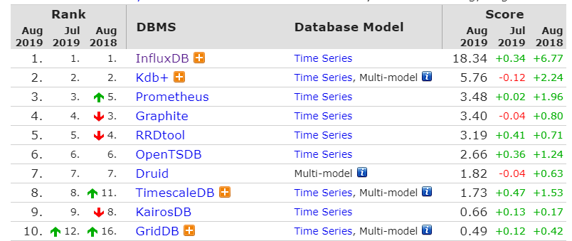

# Time Series DBMS

### [DB-Engines Ranking of Time Series DBMS](https://db-engines.com/en/ranking/time+series+dbms)

### [InfluxDB](https://www.influxdata.com/)

### 参考文献

> [时序列数据库武斗大会之什么是TSDB](http://liubin.org/blog/2016/02/18/tsdb-intro/)

>[时序列数据库武斗大会之TSDB名录 Part 1](http://liubin.org/blog/2016/02/25/tsdb-list-part-1/)

>[时序列数据库武斗大会之TSDB名录 Part 2](http://liubin.org/blog/2016/03/01/tsdb-list-part-2/)

>[InfluxDB和MySQL的读写对比测试](https://www.cnblogs.com/MikeZhang/p/InfluxDBTest20170212.html)